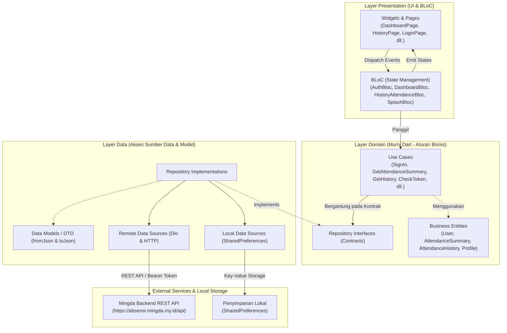
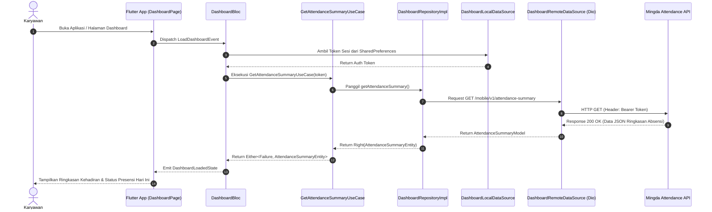

# 🏢 Mingda Absensi (Mingda Mobile Attendance)

<p align="center">
  
</p>

<p align="center">
  <strong>Employee Self-Service & Real-Time Attendance Mobile Application</strong><br>
  <em>"Sistem Presensi Karyawan Terpadu, Cepat, dan Akurat Berbasis Mobile"</em>
</p>

<p align="center">
  
  
  
  
  
  
</p>

---

## 📖 Tentang Mingda Absensi

**Mingda Absensi** adalah aplikasi mobile manajemen kehadiran karyawan (*Employee Self-Service & Mobile Attendance*) yang dirancang untuk mendukung efisiensi operasional dan transparansi presensi di lingkungan **PT Mingda**.

Aplikasi ini dibangun menggunakan framework **Flutter** dengan penerapan prinsip **Clean Architecture** dan manajemen state **BLoC (Business Logic Component)**. Melalui integrasi REST API yang aman dan responsif, karyawan dapat memantau status kehadiran harian, meninjau riwayat absensi, mengajukan cuti dan permohonan izin kerja (*Work Leave*), hingga melihat catatan disiplin kerja (*Warning Letter*) langsung dari genggaman.

---

## ✨ Fitur Utama

- 🔐 **Autentikasi & Manajemen Sesi Pengguna**
  - Autentikasi aman berbasis **JWT Bearer Token** via REST API.
  - Pengecekan otomatis validitas token sesi saat *app startup* (Splash Screen validation).
  - Penyimpanan sesi lokal yang persisten dan terenkripsi menggunakan **SharedPreferences**.
  - Mekanisme logout terintegrasi yang mencabut otorisasi token di server dan membersihkan cache lokal.

- 📊 **Dashboard Karyawan & Status Presensi Real-Time**
  - Tampilan kartu status kehadiran interaktif (*Attendance Active & Not Active Card Widget*).
  - Informasi jam kerja operasional (jadwal jam masuk kerja dan jam kepulangan).
  - Ringkasan statistik bulanan (*Attendance Summary*): total kehadiran, izin, sakit, dan keterlambatan.
  - Efek visual animasi *Skeleton Loading* untuk pengalaman pengguna yang halus saat memuat data.

- 📍 **Pencatatan & Detail Kehadiran (Detail Attendance)**
  - Tampilan detail catatan absensi harian karyawan.
  - Informasi jam check-in, check-out, durasi kerja, serta status validasi kehadiran.

- 📜 **Riwayat Presensi (History Attendance)**
  - Log riwayat kehadiran karyawan yang tersusun rapi secara kronologis.
  - Visualisasi label warna indikator status (Hadir, Terlambat, Izin, Cuti).
  - Filter rentang tanggal dan status untuk memudahkan rekap kehadiran mandiri.

- 📝 **Pengajuan Cuti & Izin Kerja (Work Leave)**
  - Formulir mandiri pengajuan izin dan cuti kerja (*Employee Self-Service*).
  - Pemantauan status persetujuan (*approval status*) secara transparan.

- ⚠️ **Surat Peringatan & Kedisiplinan (Warning Letter / SP)**
  - Informasi digital mengenai riwayat catatan kedisiplinan dan surat peringatan karyawan secara transparan dan akuntabel.

- 👤 **Profil Karyawan & Navigasi Terpadu**
  - Informasi data diri karyawan, departemen, dan nomor induk karyawan (NIK).
  - Navigasi bawah modern dan mulus menggunakan **Persistent Bottom Navigation Bar**.

---

## 🏗️ Arsitektur Sistem

Aplikasi Mingda Absensi dibangun dengan mengadopsi prinsip **Clean Architecture** (Uncle Bob) yang dipadukan dengan pola arsitektur **BLoC (Business Logic Component)**. Struktur ini membagi tanggung jawab kode ke dalam tiga lapisan terisolasi (*Separation of Concerns*), sehingga aplikasi bersifat *modular*, mudah diuji (*testable*), dan mudah dikembangkan (*maintainable*).

### 1. Diagram Layer Clean Architecture & BLoC



### 2. Diagram Alir Sinkronisasi Dashboard & Presensi

Diagram berikut menggambarkan alur interaksi saat karyawan membuka dashboard dan data kehadiran disinkronisasikan dari server:



### 3. Penjelasan Layer Arsitektur

1. **Layer Presentation (`lib/features/[fitur]/presentation/`)**
   - **BLoC**: Mengelola alur logika presentasi. Menerima *Event* dari aksi pengguna, mengeksekusi operasi melalui *Use Case*, dan memancarkan (*emit*) *State* baru ke UI.
   - **Pages & Widgets**: Komponen antarmuka yang mengonsumsi state reaktif secara terpisah (`BlocBuilder`, `BlocConsumer`, `BlocListener`). Bebas dari logika langsung pemanggilan jaringan.

2. **Layer Domain (`lib/features/[fitur]/domain/`)**
   - **Entities**: Objek data bisnis murni tanpa anotasi serialisasi JSON atau ketergantungan framework.
   - **Repository Contracts**: *Interface* abstrak yang mendefinisikan kontrak pertukaran data.
   - **Use Cases**: Komponen yang merepresentasikan satu aksi bisnis spesifik (contoh: `SignInUseCase`, `GetAttendanceSummaryUseCase`, `CheckTokenUseCase`).
   - Penanganan error menggunakan pola fungsional `Either<Failure, T>` dari pustaka **dartz**.

3. **Layer Data (`lib/features/[fitur]/data/`)**
   - **Models**: Data Transfer Object (DTO) yang memetakan entity domain serta menangani serialisasi/deserialisasi JSON (`fromJson` dan `toJson`).
   - **Data Sources**:
     - *Remote Data Source*: Mengelola koneksi jaringan via HTTP REST client (**Dio** & **http**).
     - *Local Data Source*: Mengelola penyimpanan token sesi dan cache lokal via **SharedPreferences**.
   - **Repository Implementations**: Mengimplementasikan kontrak interface dari Domain layer dengan mengorkestrasikan *data sources* dan mengonversi exception menjadi tipe *Failure*.

4. **Core & App Configuration (`lib/core/` & `lib/app/`)**
   - **`app/config/`**: Konfigurasi global aplikasi, inisialisasi interceptor jaringan `dio_client.dart`, observer BLoC global, dan `app_routes.dart`.
   - **`core/di/`**: Inisialisasi *Dependency Injection* menggunakan **GetIt** (`sl`) untuk integrasi dependensi yang *loosely coupled*.
   - **`core/errors/`**: Standarisasi penanganan kesalahan (`ServerFailure`, `AuthFailure`, `ValidationFailure`, dll.).
   - **`core/theme/`**: Konfigurasi tema global, palet warna, dan `app_text_styles.dart`.
   - **`core/widgets/`**: Komponen UI yang digunakan bersama (misalnya `Skeleton`).

---

## 🛠️ Teknologi & Dependensi

| Kategori | Teknologi / Pustaka | Deskripsi |
| :--- | :--- | :--- |
| **Framework** | [Flutter](https://flutter.dev) (SDK: `^3.10.1`) | Framework UI lintas platform |
| **Bahasa** | [Dart](https://dart.dev) | Bahasa pemrograman utama |
| **State Management** | [flutter_bloc](https://pub.dev/packages/flutter_bloc) & [bloc](https://pub.dev/packages/bloc) | State management BLoC yang terprediksi dan reaktif |
| **Dependency Injection** | [get_it](https://pub.dev/packages/get_it) | Service locator untuk dependency injection |
| **Functional Error Handling**| [dartz](https://pub.dev/packages/dartz) & [equatable](https://pub.dev/packages/equatable) | Either pattern (Failure / Success) & value equality comparison |
| **Komunikasi Data** | [dio](https://pub.dev/packages/dio) & [http](https://pub.dev/packages/http) | REST API client dengan interceptor token dan error handler |
| **Penyimpanan Lokal** | [shared_preferences](https://pub.dev/packages/shared_preferences) | Penyimpanan kredensial token dan konfigurasi sesi lokal |
| **Navigasi** | [persistent_bottom_nav_bar](https://pub.dev/packages/persistent_bottom_nav_bar) | Navigasi menu bawah dengan persistensi state halaman |
| **Responsivitas & UI** | [flutter_screenutil](https://pub.dev/packages/flutter_screenutil) & [google_fonts](https://pub.dev/packages/google_fonts) | Penyesuaian ukuran layar dinamis dan tipografi font kustom |
| **Animasi & Grafis** | [lottie](https://pub.dev/packages/lottie) & [flutter_svg](https://pub.dev/packages/flutter_svg) | Animasi interaktif JSON dan rendering ikon vektor SVG |
| **Utilitas Waktu** | [intl](https://pub.dev/packages/intl) | Pemformatan tanggal, hari, dan waktu lokal Indonesia |

---

## 📂 Struktur Direktori (Clean Architecture)

```text
lib/
├── app/
│   └── config/                           # Konfigurasi global aplikasi
│       ├── app_routes.dart               # Definisi routing & navigasi halaman
│       ├── dio_client.dart               # Klien Dio terpusat (BaseURL, Header, Interceptor)
│       └── global_bloc_observer.dart     # Logging transisi state BLoC
│
├── core/                                 # Komponen reusable lintas fitur
│   ├── errors/                           # Definisi Failure & Exception
│   │   ├── exceptions.dart
│   │   └── failures.dart
│   ├── theme/                            # Konfigurasi gaya teks, warna, & tema
│   │   ├── app_colors.dart
│   │   ├── app_text_styles.dart
│   │   └── app_theme.dart
│   └── widgets/                          # Widget reusable bersama (Skeleton, dll.)
│       └── skeleton.dart
│
├── features/                             # Modul fitur mandiri (Clean Architecture)
│   ├── auth/                             # Fitur Autentikasi (Login, Session, Logout)
│   │   ├── data/                         # Data Layer (Remote/Local DS, Models, RepoImpl)
│   │   ├── domain/                       # Domain Layer (Entities, Contracts, UseCases)
│   │   ├── presentation/                 # Presentation Layer (AuthBloc, LoginPage)
│   │   └── auth_injection.dart           # Setup DI modul Auth
│   │
│   ├── dashboard/                        # Fitur Dashboard Utama Karyawan
│   │   ├── data/                         # Data Layer (AttendanceSummaryModel, ProfileModel)
│   │   ├── domain/                       # Domain Layer (Entities, UseCases)
│   │   ├── presentation/                 # Presentation (DashboardBloc, DashboardPage, ProfilePage)
│   │   └── dashboard_injection.dart      # Setup DI modul Dashboard
│   │
│   ├── detail_attendance/                # Fitur Rincian Catatan Kehadiran Harian
│   │   ├── data/
│   │   ├── domain/
│   │   └── presentation/
│   │
│   ├── history_attendance/               # Fitur Riwayat Presensi & Filter Tanggal
│   │   ├── data/                         # Data Layer (Remote DS, Models, RepoImpl)
│   │   ├── domain/                       # Domain Layer (AttendanceHistoryEntity, UseCase)
│   │   ├── presentation/                 # Presentation (HistoryBloc, HistoryAttendancePage)
│   │   └── history_attendance_injection.dart
│   │
│   ├── root/                             # Fitur Root Shell & Bottom Navigation
│   │   ├── data/ & domain/
│   │   └── presentation/                 # RootPage (Persistent Bottom Navigation)
│   │
│   ├── splash/                           # Fitur Splash Screen & Validasi Sesi
│   │   ├── data/ & domain/
│   │   ├── presentation/                 # SplashBloc & SplashPage
│   │   └── splash_injection.dart
│   │
│   ├── warning_letter/                   # Fitur Riwayat Surat Peringatan (SP) Karyawan
│   │   └── presentation/                 # WarningLetterPage
│   │
│   └── work_leave/                       # Fitur Pengajuan Izin & Cuti Kerja
│       └── presentation/                 # WorkLeavePage
│
└── main.dart                             # Entry point aplikasi & inisialisasi modul
```

---

## 🚀 Memulai (Getting Started)

### Prasyarat
Sebelum menjalankan proyek ini, pastikan komputer Anda telah terpasang:
- [Flutter SDK](https://docs.flutter.dev/get-started/install) (versi `^3.10.1` atau yang lebih baru)
- [Dart SDK](https://dart.dev/get-dart)
- Editor yang didukung: VS Code atau Android Studio dengan plugin Flutter & Dart
- Emulator Android / Simulator iOS atau perangkat fisik yang terhubung

### Langkah Instalasi

1. **Clone repositori**:
   ```bash
   git clone https://github.com/neusid/mingda-absensi.git
   cd mingda-absensi
   ```

2. **Pasang dependensi pustaka**:
   ```bash
   flutter pub get
   ```

3. **Jalankan aplikasi**:
   ```bash
   flutter run
   ```

---

## 📱 Alur Penggunaan

1. **Buka Aplikasi (Splash Screen)**: Aplikasi secara otomatis memeriksa keberadaan token sesi di penyimpanan lokal. Jika token valid, pengguna langsung diarahkan ke Dashboard; jika tidak, pengguna diarahkan ke Halaman Login.
2. **Masuk (Login)**: Masukkan alamat email terdaftar dan kata sandi akun karyawan Anda.
3. **Dashboard Kehadiran**:
   - Tinjau status presensi hari ini pada kartu kehadiran.
   - Pantau ringkasan jam kerja operasional dan akumulasi statistik absensi bulanan.
4. **Riwayat Presensi**: Akses menu *History* untuk melihat rekap kehadiran harian beserta indikator status keterlambatan/kehadiran.
5. **Pengajuan Cuti (Work Leave)**: Ajukan cuti kerja atau izin kerja melalui form pengajuan mandiri.
6. **Surat Peringatan (Warning Letter)**: Akses menu catatan SP untuk melihat riwayat kedisiplinan kerja.
7. **Profil & Keluar**: Tinjau profil karyawan atau lakukan *Logout* untuk mengakhiri sesi kerja dengan aman.

---

## 📄 Lisensi & Hak Cipta

Dikelola dan dikembangkan untuk keperluan operasional **PT Mingda**. Seluruh hak cipta dilindungi undang-undang.
